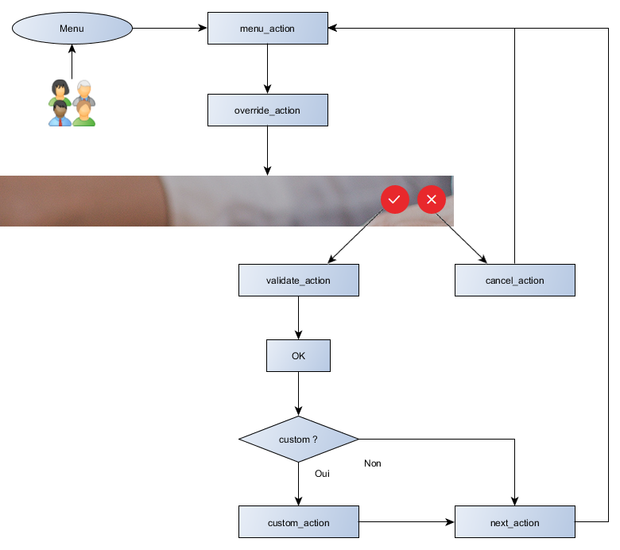

# Action

## Description

This section describes the custom functions on actions.

Theses functions are :
* [menu-action](#menu-action) : Defines the keys to use when an action is launched from menu. This method is called while the user clicks on a menu option which concerns an action with input.
* [override-action](#override-action) : Replaces the action to execute by another one.
* [cancel-action](#cancel-action) : Indicates whether current action's cancellation should be performed.
* [validate-action](#validate-action) : Indicates whether the current action could be performed.
* [custom-action](#custom-action) : Executes a custom action.
* [next-action](#next-action) : Retrieves the next action to prepare.



---
### override-action
override-action : `(string, {}, {}) => Promise` Overrides the current action by another one. It may be totally different.

This method is called before the action is prepared (before execution for action without UI). It is called recursively if it returns a new action.

The `params` parameter contains the following properties :
* `action` : current action to prepare
* `actionName` : current action name (can be filtered)
* `pks` : selected keys (for action page)
* `options` : current action's options (link, query, etc)

This method should return an object with the following properties :
* `action` : new action to prepare.
* `pks` : array of identifiers (it may be `undefined` or `null`)
* `options` : new action's options (it may be `undefined` or `null`)

Default : `undefined` : the current action is prepared.
#### Examples :
```javascript

/* Standard example */

customServiceProvider.setImplementation('override-action')('contact', 'action', overrideActionStd, {});

overrideActionStd.$inject = ['$q', 'entityModel'];

function overrideActionStd($q, entityModel){
  return function(entityName, obj, params, defaultFunc) {
    var model = entityModel.entity(entityName); // get the entity's model
      // override the action only if the request action is 'delete'
      // you can test the request action with the params.actionName (like in the example overrideActionStd),
      // the params.action (like in the example overrideActionTag),
      // or by setting a filter in the call of customProvider.setImplementation (like for the example overrideActionRest)
      if ('delete' === params.actionName){
        // return the override action 'display' in a promise
        return $q.when({
          action: model.getAction('display') // load the correct action from the entity's model
        });
      }            
    // in all other cases, return the default result
    return defaultFunc(entityName, obj, params);
  }
}

/* Example using framework's functions */

// using filter to execute the function overrideActionRest only if the request action's name is 'update'
// you can test the request action with the params.actionName (like in the example overrideActionStd),
// the params.action (like in the example overrideActionTag),
// or by setting a filter in the call of customProvider.setImplementation (like for the example overrideActionRest)
customServiceProvider.setImplementation('override-action')('contact', 'action', overrideActionRest, {
  actionName: 'update'
});

overrideActionRest.$inject = ['$q', 'entityModel', 'restService'];

function overrideActionRest($q, entityModel, restService){
  return function(entityName, obj, params, defaultFunc) {
    var model = entityModel.entity(entityName); // get the entity's model
    // override the action only if the action was requested for one object
    if (params.pks.length === 1){
      // get entity from rest (and return its results)
      return restService.entity(entityName, params.pks[0], params.actionName).then(function (result){
          if (result.data){
            var entity = result.data;
            // override the action 'update' to 'delete' only if the entity's status is '42' (fonctionnal example)
            if ('42' === entity.status){
              // return the override action 'delete' in a promise
              return $q.when({
                action: model.getAction('delete') // load the correct action from the entity's model
              });
            }
          }
        });
    } else if (params.pks.length > 1){
      // if the action was requested for more than one object
      // return the override action 'display' in a promise
      // there is only one mandatory attribute to set is action
      // (if not defined, attributes pks and options are not overrided)
      return $q.when({
        action: model.getAction('display')
      });
    }
    // in all other cases, return the default result (here it will be the action 'update')
    return defaultFunc(entityName, obj, params);
  }
}

/* Example with an http request, messages for the user */

customServiceProvider.setImplementation('override-action')('tcavv-tag', 'action', overrideActionTag, {});

overrideActionTag.$inject = ['$http', '$q', 'entityModel', 'messageService', 'Url'];

function overrideActionTag($http, $q, entityModel, messageService, Url) {
  return function(entityName, obj, params, defaultFunc) {
    var model = entityModel.entity(entityName); // get the entity's model
    // override the action only if the request action is 'delete'
    // you can test the request action with the params.actionName (like in the example overrideActionStd),
    // the params.action (like in the example overrideActionTag),
    // or by setting a filter in the call of customProvider.setImplementation (like for the example overrideActionRest)
    if (model.getAction('delete') === params.action) {
      // http request to get a list of linked objects to the action's entity (and return its result)
      return $http({
        url: Url.backend + 'reporting/nombre-dossiers',
        method: 'GET',
        params: {tag: model.getPrimaryKeyFromString(params.pks[0]).id}
      }).then(function(response) {
        // if the response contains several objects, override the action to 'display' with a message
        var nombreDossiers = response.data || 0;
        if (nombreDossiers > 0) {
          // throw a error message to the user
          messageService.display({
            display: 'Impossible de supprimer l\'offre car au moins un dossier est li\u00E9 \u00E0 cette offre.',
            level: 'danger'
          });
          // return the override action 'display' (with all attributes) in a promise
          return $q.when({
            action: model.getAction('display'),
            pks: params.pks,
            options: params.options
          });
        } else {
          // if there no object in the response, the action is not overrided
          // throw an info message to the user
          messageService.display({
            display: 'Cette offre sera supprim\u00E9e. Merci de confirmer en cliquant sur Valider.',
            level: 'info',
            duration: 2500
          });
        }
      });
    }
    // in all other cases, return undefined (default result) so the action won't be overrided
    return $q.when(undefined);
  };
}
```
---
### menu-action
menu-action : `(string, {}, {}) => Promise` Defines the keys to use when an action is launched from menu.

This method is called while an action with input (single or multiple) is triggered from the menu.

The `params` parameter contains the following properties :
* `action` : current action to prepare
* `options` : current action's options (link, query, etc)

This method should return an array of keys.

Default: `undefined` : an error message is displayed.
#### Example :
```javascript
customServiceProvider.setImplementation('menu-action')('afs-task', 'action', getRandomTask, {});
/**
 * Récupère une tâche de manière aléatoire.
 * @param {$http} $http service HTTP pour récupérer la tâche.
 * @param {entityModel} entityModel le service modèle entité pour récupérer le modèle de afs-task.
 * @return {Function} la fonction retournant une promesse contenant la clef de la tâche.
 */
function getRandomTask($http, entityModel) {
  return function () {
    var task = entityModel.entity('afs-track');
    return $http({
        url: 'http://localhost:8888/afs/rest/afs-track/action/randomTask',
        method: 'GET',
        params: {
          'r-r': new Date().getTime()
        }
    })
    .then(function(response) {
      return [entityModel.extractPrimaryKey(response.data)];
    });
  };
}
getRandomTask.$inject = ['$http', 'entityModel'];
```

---
### cancel-action
cancel-action : `(string, {}, {}) => Promise` Indicates whether current action's cancellation should be performed.

This method is called while the user clicks on a `cancel` button onto an action page.

The `params` parameter contains the following properties :
* `action` : current action to cancel

This method should return `true` to allow cancellation, `false` otherwise.

Default: `true` : action is cancelled.
#### Example :
```javascript
customServiceProvider.setImplementation('cancel-action')('lib-band', 'action', deleteBand, {});
/**
 * Ajoute une alerte en cas de supression.
 * @param {$q} $q le service de promesse.
 * @return {Function} Si l'action en cours est l'action de suppression, une fenêtre de confirmation est affichée à l'utilisateur. L'action est  
 * annulée ou non selon le choix de l'utilisateur. Si c'est une autre action, le résultat de l'implémentation par défaut est retourné.
 */
function deleteBand($q) {
  return function (entityName, bean, param, defaultFn) {
    if (param.action.isDelete()) {
      return $q.when(confirm('Voulez-vous vraiment annuler la suppression ?'));
    }
    return defaultFn(entityName, bean, param);
  }
}
```
---
### validate-action
validate-action : `(string, {}, {}) => Promise` Indicates whether the current action could be performed.

This method is called while the user clicks on a `validate` button onto an action page.

The `params` parameter contains the following properties :
* `action` : current action to execute
* `pks` : selected keys
* `options` : current action's options (link, query, etc)

This method should return `true` to allow processing, `false` otherwise.

Default: `true` : action is performed.
#### Example :
```javascript
customServiceProvider.setImplementation('validate-action')('lib-band-member', 'action', associateBandMember, {});
/**
 * Permet de valider l'ajout d'un membre dans un groupe.
 * @param {$q} $q service de promesse.
 * @param {contextService} contextService service du contexte applicatif.
 * @param {entityModel} entityModel service des modèles d'entité.
 * @param {messageService} messageService service des messages.
 * @param {$filter} $filter service des filtres.
 * @return {Function} Une fonction de validation.
 */
function associateBandMember($q, contextService, entityModel, messageService, $filter) {
  return function (entityName, entity, params, defaultFn) {
    var currentContext = contextService.getCurrent();
    var action = currentContext.action;

    // on ne teste que si on est en édition ou en création
    if (!action.isEdit() && !action.isCreate()) {
      return defaultFn(entityName, entity, params);
    }
    var valid = true;

    // Récupération du groupe dans le cache (qui a été chargé grâce au lien).
    var bandMemberEntity = entityModel.entity('lib-band-member');
    bandMemberEntity.getQuery('lib-band-member');
    var linkBandMemberMember = bandMemberEntity.getLink('lib-band-members-r-lib-band');
    var fk = [];
    Object.keys(linkBandMemberMember.fk).forEach(function (fkField) {
      fk.push(entity[fkField]);
    });
    var band = currentContext.getCache(linkBandMemberMember.dstEntity, fk);

    // Vérification de la date de début.
    if (entity.since) {
      valid = validateDate(band, entity.since.getTime(), 'Since') && valid;
    }

    // Vérification de la date de fin.
    if (entity.until) {
      valid = validateDate(band, entity.until.getTime(), 'Until') && valid;
    }

    return $q.when(valid);

    /**
     * Valide la date et crée un message d'erreur en cas d'échec.
     * @param {string} band l'entité groupe.
     * @param {number} dateBandMember la date à tester.
     * @param {string} nameDate le nom de la date pour l'affichage de l'erreur.
     * @return {boolean} si la date est valide.
     */
    function validateDate(band, dateBandMember, nameDate) {
      var valid = true;
      if (band.creation && dateBandMember < band.creation) {
        messageService.display(createErrorMessage(false, band.creation, nameDate));
        valid = false;
      }
      if (band.enddate && dateBandMember > band.enddate) {
        messageService.display(createErrorMessage(true, band.enddate, nameDate));
        valid = false;
      }
      return valid;
    }

    /**
     * Crée le message d'erreur.
     * @param {boolean} after booléen pour indiquer si c'est un message d'erreur pour dépassement de date avant ou après.
     * @param {number} date la date à afficher (timestamp).
     * @param {string} nameDate le nom de la date à afficher.
     * @return {{display: string, parameters: {dateName: string}, level: string, duration: number}}
     */
    function createErrorMessage(after, date, nameDate) {
      var timeDisplayError = 7000;
      var levelDisplayError = 'danger';
      var $filterDate = $filter('date');
      var typeControl = after ? 'after' : 'before';
      var errorMessage = {
        display: 'error-message.date-do-not-' + (typeControl),
        parameters: {
          'dateName': nameDate
        },
        level: levelDisplayError,
        duration: timeDisplayError
      };
      errorMessage.parameters[typeControl] = $filterDate(new Date(date));
      return errorMessage;
    }
  };
}
```
---
### custom-action
custom-action : `(string, {}, {}) => Promise` Executes a custom action.

This method is called while a custom action is validated.

The `params` parameter contains the following properties :
* `action` : current action to execute
* `pks` : selected keys
* `options` : current action's options (link, query, etc)

This method may return a new context or `undefined`.

Default: `undefined` : it does not do anything.

### next-action
next-action : `(string, {}, {}) => Promise` Retrieves the next action to prepare.

This method is called after executing an action to know where to navigate.

The `params` parameter contains the following properties :
* `action` : Current executed action
* `actionName` : current action name (can be filtered)
* `pks` : selected keys
* `options` : current action's options (link, query, etc)

This method should return an object with the following properties :
* `action` : new action to prepare.
* `options` : new action's options (it may be `undefined` or `null`)

Default : the prototyped next action.
#### Example :
```javascript
var returnObject = {
    options: {
      /**
       * Link form action to execute
       */
      link: null,
      /**
       * Query to add to execute action.
       */
      query: null
    },
    /**
     * next action
     */
    action: null,
    functions : {
        /**
         * Execute after back query (POST/PUT/GET) who execute for real the action.
         * 
         * @param {object} data object given by back 
         */
        afterExecute: function(data) {},
        /**
         * Replace the default process ( defaultFunction (currentContext, ids, currentAction, options) )
         * 
         * @param {function} defaultFunction default process function
         * @param {Action} actionToExecute action to execute
         * @param {Context} currentContext current context
         * @param {string[]} ids array of id
         * @param {Action} currentAction current action
         * @param {object} options
         * 
         * @returns return promess of next context to go
         */
        execute: function (defaultFunction, actionToExecute, currentContext, ids, currentAction, options) {},
        /**
         * Execute after principal entity load
         * 
         * @param {object} data entity loaded
         */
        afterBackLoad: function (data) {}
    }
};
```
